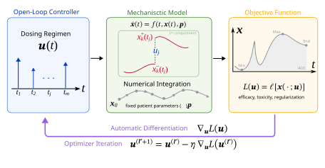

# DiffDose


**Differentiable mechanistic simulation for dose-amplitude, dose-timing, and individualized regimen optimization.** DiffDose applies automatic differentiation to clinical dosing controls

<p align="center">
  
</p>

## Analyses

| Script Name | Model | Control |
|---|---|---|
| [`IDR.py`](IDR.py) | Indirect biomarker response PK/PD | fixed-time dose amplitude |
| [`TGI.py`](TGI.py) | Tumor-growth inhibition | fixed-time dose amplitude |
| [`BiTE.py`](BiTE.py) | Bispecific T-cell engager | fixed-time dose amplitude |
| [`NeutropeniaDDE.jl`](NeutropeniaDDE.jl) | Neutropenia State-dependent DDE | dose administration timing |
| [`Mosun.jl`](Mosun.jl) | Mosunetuzumab QSP model | VPop patient-specific dose amplitude |

Each analysis keeps parameters, model equations, numerical solve, objective, gradients, optimization, and output in that order. Reusable model code, campaign utilities, and parity checks are grouped in [`utils/`](utils/). [`OptimizationUtils.py`](utils/OptimizationUtils.py) is limited to generic optimizer execution, finite differences, and CSV writing; the translated equations are isolated in [`NeutropeniaDDEModel.jl`](utils/NeutropeniaDDEModel.jl) and [`MosunModel.jl`](utils/MosunModel.jl).

## Dose Events And Gradients

| Analysis | Event representation | Differentiated control |
|---|---|---|
| IDR, TGI, BiTE benchmarks | OptiDose short `epsilon`-window input | fixed-time amplitude |
| IDR supplementary comparison | instantaneous segmented state jumps | fixed-time amplitude |
| Neutropenia DDE manuscript run | sharp sigmoid onset (`epsilon = 0.0005` day) | administration time |
| Mosun VPop | instantaneous `PresetTimeCallback` state jumps | fixed-time amplitude |

For exact fixed-time jumps, the dose remains an AD value in the jump map and its derivative propagates through every later solver segment. See `_jump_event_loss` in [`IDR.py`](IDR.py) and `apply_event_deltas!` in [`MosunModel.jl`](utils/MosunModel.jl). Because the DDE optimizes event times rather than amplitudes, its manuscript workflow uses the explicitly documented timing relaxation in [`NeutropeniaDDEModel.jl`](utils/NeutropeniaDDEModel.jl). The Craig papers define the biological DDE; the dosing wrappers and timing relaxation are DiffDose implementation choices. These are separate numerical experiments.

The IDR representation check is reported separately in [Supplementary Figure 2](Figures/Supplementary/SupplementaryFigure2.svg); its plotting workflow invokes `run_dosing_representation_comparison` rather than the primary benchmark runner.

## Quick Start

Python:

```bash
python -m venv .venv
source .venv/bin/activate
pip install -r requirements.txt
python IDR.py --preset quick --output output
python TGI.py --preset quick --output output
python BiTE.py --preset quick --output output
```

Julia uses two pinned environments because the manuscript DDE and Mosun
analyses were developed against different SciML and Optim stacks. Instantiate
each once:

```bash
juliaup add 1.11.6
juliaup add 1.12.5
julia +1.11.6 --project=environments/dde -e 'using Pkg; Pkg.instantiate()'
julia +1.12.5 --project=environments/mosun -e 'using Pkg; Pkg.instantiate()'
julia +1.11.6 --project=environments/dde NeutropeniaDDE.jl --preset quick --output output
julia +1.12.5 --project=environments/mosun Mosun.jl --preset quick --patients 1 --output output
```

The separate environments preserve the package families used for each
analysis; they do not duplicate source code. The explicit Juliaup selectors
match the versions recorded in the committed manifests.

| Environment | Scripts |
|---|---|
| `environments/dde` | `NeutropeniaDDE.jl`, `utils/NeutropeniaDDEParity.jl`, `utils/DDEPatch.jl`, `Figures/plot_Figure3.jl`, and `GumbelSoftmax.jl` |
| `environments/mosun` | `Mosun.jl`, `utils/MosunParity.jl`, `utils/VPopGeneration.jl`, and the Mosun model utilities |

Quick presets are smoke tests, not manuscript reproductions. Full benchmark commands are explicit:

```bash
python IDR.py --preset paper --methods all --output output
python TGI.py --preset paper --methods all --output output
python BiTE.py --preset paper --methods all --output output
python IDR.py --preset paper --compare-dose-representations --output output
julia +1.11.6 --project=environments/dde NeutropeniaDDE.jl --preset paper --methods all --output output
julia +1.12.5 --project=environments/mosun Mosun.jl --preset paper --patients all --output output
```

Generated convergence histories, optimizer summaries, trajectories, and plots are written beneath ignored `output/`.

## Additional Methods

The VPop campaign is split into explicit stages so intermediate banks remain generated data:

```bash
julia +1.12.5 --project=environments/mosun utils/VPopGeneration.jl --stage efast --preset quick --output output/vpop
python utils/VPopPruning.py --stage prefilter --preset quick --input output/vpop/efast --output output/vpop
julia +1.12.5 --project=environments/mosun utils/VPopGeneration.jl --stage resimulate --preset quick --output output/vpop --candidates output/vpop/trajectory_resim_candidate_parameters.csv
python utils/VPopPruning.py --stage prune --preset quick --input output/vpop --output output/vpop
```

[`GumbelSoftmax.jl`](GumbelSoftmax.jl) is a runnable relaxed quantized-dose/time example. [`DDEPatch.jl`](utils/DDEPatch.jl) isolates the declared-delay compatibility change evaluated before the manuscript analysis adopted undeclared lags and smooth differentiable dose timing.

The original Hosseini MATLAB/SimBiology project is available in the [official source-code archive](https://static-content.springer.com/esm/art%3A10.1038%2Fs41540-020-00145-7/MediaObjects/41540_2020_145_MOESM3_ESM.zip) for the [published model](https://doi.org/10.1038/s41540-020-00145-7). The Craig-model sources are cited by DOI in the neutropenia module. Compact parity tests compare both Julia translations with committed trajectories exported from their source implementations:

```bash
julia +1.12.5 --project=environments/mosun utils/MosunParity.jl
julia +1.11.6 --project=environments/dde utils/NeutropeniaDDEParity.jl
```

These tests validate forward-model translation. They are distinct from the manuscript gradient checks and optimization experiments.

## Figures

The supplied SVGs are the authoritative, manually finished manuscript artwork. Paired plotting scripts regenerate computational bases under `output/figures/` and never overwrite these files.

The Figure 4 workflow also writes the six-endpoint patient-level win table, complete and top-eight endpoint-pattern tables, bounded primary-endpoint improvements, dose summaries, and final-loss parameter associations beneath `output/figures/Figure4_source/`.

Main figures: [Figure 1](Figures/Figure1_DiffDose.svg) | [Figure 2](Figures/Figure2_DiffDose.svg) | [Figure 3](Figures/Figure3_DiffDose.svg) | [Figure 4](Figures/Figure4_DiffDose.svg)

Supplementary figures: [1](Figures/Supplementary/SupplementaryFigure1.svg) | [2](Figures/Supplementary/SupplementaryFigure2.svg) | [3](Figures/Supplementary/SupplementaryFigure3.svg) | [4](Figures/Supplementary/SupplementaryFigure4.svg) | [5](Figures/Supplementary/SupplementaryFigure5.svg) | [6](Figures/Supplementary/SupplementaryFigure6.svg) | [7](Figures/Supplementary/SupplementaryFigure7.svg) | [8](Figures/Supplementary/SupplementaryFigure8.svg) | [9](Figures/Supplementary/SupplementaryFigure9.svg)

## Data

| File | Contents |
|---|---|
| [`MosunVPop250.csv`](data/MosunVPop250.csv) | Selected virtual-patient parameterizations; `Mosun.jl` accepts any row count |
| [`MosunParameterRanges.csv`](data/MosunParameterRanges.csv) | Complete 62-parameter sampling universe |
| [`MosunVariantOverrides.tsv`](data/MosunVariantOverrides.tsv) | Published model-variant parameter overrides |
| [`HosseiniFigure5IL6Tcell.csv`](data/HosseiniFigure5IL6Tcell.csv) | Digitized IL-6 and activated T-cell targets |
| [`HosseiniFigure5Tumor.csv`](data/HosseiniFigure5Tumor.csv) | Digitized day-84 tumor waterfall targets |
| [`NeutropeniaDDEParameters.csv`](data/NeutropeniaDDEParameters.csv) | Code-aligned DDE defaults, manuscript overrides, parameter roles, and provenance |
| [`MosunParityParameters.csv`](data/MosunParityParameters.csv) | Parameters for the compact SimBiology translation check |
| [`MosunParityReference.csv`](data/MosunParityReference.csv) | SimBiology IL-6 and tumor reference trajectory |
| [`NeutropeniaParity*.csv`](data/NeutropeniaParityNoGCSF.csv) | MATLAB ANC reference trajectories for three one-cycle scenarios |

## Reproducibility Boundary

This release contains the five manuscript analyses, translated model equations, selected VPop and sampling specification, calibration targets, focused source-model parity fixtures, plotting workflows, all six Mosun endpoint comparisons, and final figure assets. Manuscript presets regenerate optimization summaries, histories, trajectories, endpoint-win source tables, and computational plots beneath `output/`; the supplied SVGs remain the manually finished publication figures.

The DDE and Mosun analyses intentionally ship with separate, committed
`Project.toml`/`Manifest.toml` pairs under `environments/`. Either manifest should be updated only together with its parity test and paper preset.

## Citation And License

Citation metadata are provided in [`CITATION.cff`](CITATION.cff). This code is released under the [BSD 3-Clause License](LICENSE).
